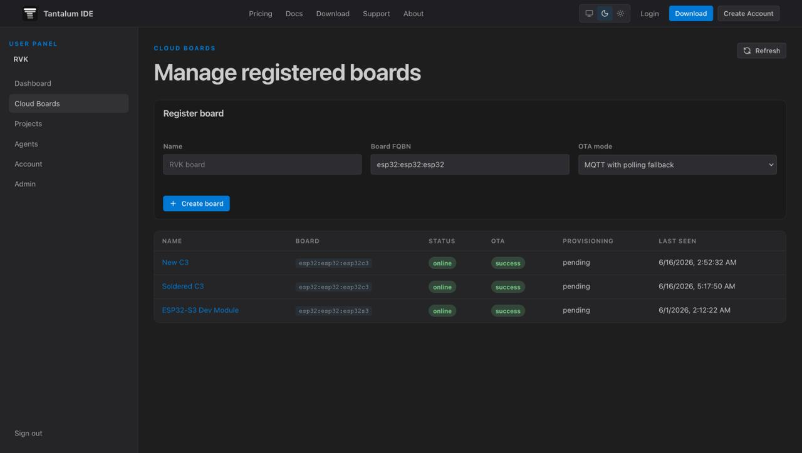
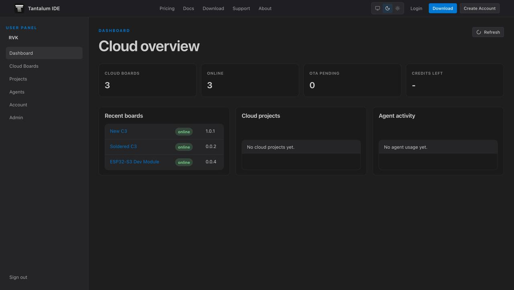

<div align="center">
  

  # Tantalum Web App

  [](https://opensource.org/licenses/MIT)
  [](https://nextjs.org/)
  [](https://appwrite.io/)
  [](https://react.dev/)

  **The unified marketing page, auth portal, user dashboard, and admin panel for the Tantalum platform.**
</div>

## 📸 Screenshots

<p align="center">
  
  
</p>

## ✨ What is it?

The **Tantalum Web App** is the frontend gateway to the Tantalum ecosystem. Built with cutting-edge Next.js 15 and Appwrite, it offers a seamless experience ranging from the initial marketing splash page to a full-fledged dashboard and administrative portal.

## 🚀 Features

- **Marketing Pages:** SEO-optimized landing pages to introduce Tantalum.
- **Authentication Portal:** Secure login, registration, and session management.
- **User Dashboard:** A comprehensive hub for users to manage their Tantalum experience.
- **Admin Panel:** Powerful moderation and administration tools.
- **Appwrite Integration:** Fully integrated with Appwrite for backend services and data synchronization.

## 🛠 Getting Started

### Prerequisites

- Node.js (v18 or higher)
- npm, yarn, or pnpm
- Access to an Appwrite instance (Cloud or Self-Hosted)

### Installation

1. **Clone the repository:**
   ```bash
   git clone <repository-url>
   cd tantalum-web-app
   ```

2. **Install dependencies:**
   ```bash
   npm install
   ```

3. **Configure Environment Variables:**
   Copy the example environment file and fill in your Appwrite credentials.
   ```bash
   cp .env.example .env.local
   ```
   *(Update `.env.local` with your Appwrite endpoint, project ID, and other required variables).*

4. **Run the development server:**
   ```bash
   npm run dev
   ```
   Open [http://localhost:3000](http://localhost:3000) with your browser to see the result.

## 🏠 Self-Hosting Guide

Tantalum is designed to be easily self-hostable alongside your Appwrite instance.

1. **Set up Appwrite:**
   Ensure your Appwrite instance is running. If you are self-hosting Appwrite, follow the [Appwrite self-hosting documentation](https://appwrite.io/docs/self-hosting).

2. **Deploy the Frontend:**
   The Tantalum Web App can be deployed anywhere Next.js runs (Vercel, Docker, Node.js server).
   
   To build for production:
   ```bash
   npm run build
   npm run start
   ```

3. **Configure Appwrite via Scripts:**
   This project includes built-in scripts to automatically configure your Appwrite site resources (databases, collections, buckets).
   ```bash
   # Configure all Appwrite site resources
   npm run appwrite:configure

   # Only configure environment variables needed for Appwrite
   npm run appwrite:configure:vars
   ```

## 👨‍💻 Development

Check out the following documents to learn more about the project architecture and how to contribute:

- [ARCHITECTURE.md](./ARCHITECTURE.md) - Deep dive into the structure and technical decisions.
- [CONTRIBUTING.md](./CONTRIBUTING.md) - Guidelines for contributing to the project.
- [SECURITY.md](./SECURITY.md) - Security policies and vulnerability reporting.

## 📜 Scripts

| Command | Description |
|---|---|
| `npm run dev` | Starts the Next.js development server on `127.0.0.1:3000`. |
| `npm run build` | Builds the application for production usage. |
| `npm run start` | Starts the production server. |
| `npm run appwrite:configure` | Configures Appwrite collections, buckets, and settings based on `appwrite.config.json`. |
| `npm run appwrite:configure:vars` | Only synchronizes variables required by the Appwrite environment. |

## 📄 License

This project is licensed under the [MIT License](LICENSE) - see the LICENSE file for details.
